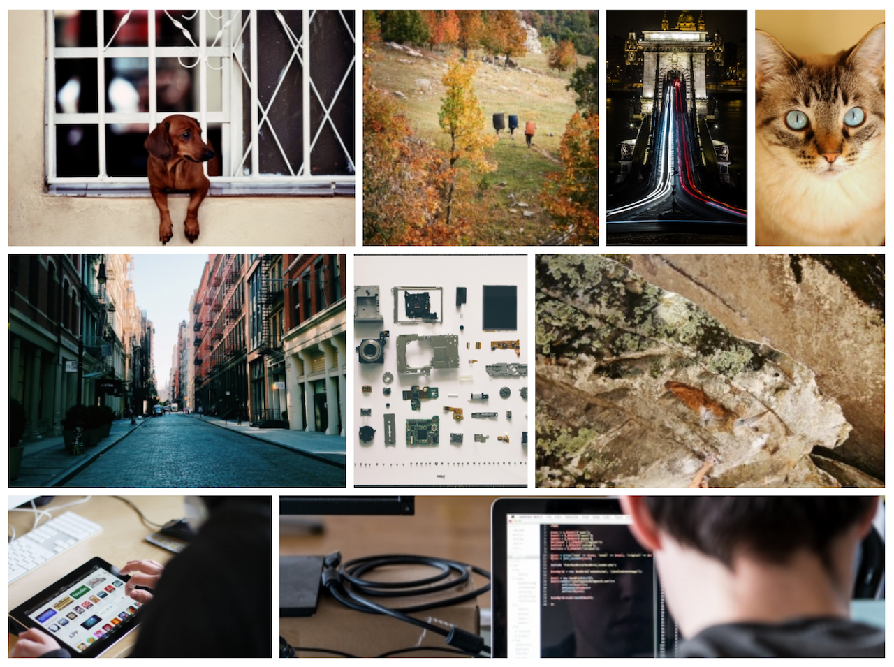
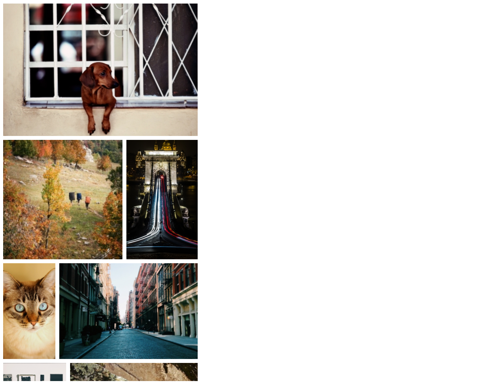

# ChoosyGallery

_This project is in alpha. The API may change before v1.0.0._

ChoosyGallery is a jQuery plugin that tiles collections of images in a justified grid (so they fill their container wall-to-wall).

What makes ChoosyGallery different from other photo gallery plugins is that **you can specify a different desired display size for each image in the gallery**. ChoosyGallery's tiling algorithm tries to minimize the error between each photo's desired size and the actual size it ends up rendered at as result of its placement in the gallery.

This lets the designer (you!) **express preferences for certain images to be given more screen real estate than others**. The tiling algorithm always tries to adhere to these preferences as it re-arranges images in response to changing container size.



_Example images served courtesy of [placeimg.com](http://placeimg.com)_

In the above example, the dog and cat images share a row together, so they are obligated to be the same height. However, in the (unseen) HTML markup, the dog image has a bigger value of `data-desired-height` than the cat image.

Below you can see the same gallery after it's been re-tiled for a narrower screen.



The re-tiling gave preferential treatment to the dog image by putting it on its own row. The cat, whose `data-desired-height` value was smaller, has to share a row with another image.

## How to use

```html
<div class='gallery'>
  
  
  
  
  
</div>

<script>
  $('.gallery').choosyGallery();
</script>
```

ChoosyGallery automatically hides the gallery while it works, preventing any kind of flickering during page load, and redraws the gallery whenever the page is resized.

## More than just images

ChoosyGallery will happily tile the children of any container, as long as the container has a `width` that is independent of its contents, and the children each have a `width` and `height` that is independent of the size of their parent and are styled so that they're willing to sit next to one another in a line (e.g. with `float: left` or `display: inline-block`).

This means you can tile `<figure>`, `<a>` or `<div>` elements with images inside of them, or presumably other content like embedded videos.

## Troubleshooting

Beware of whitespace. If you make the gallery items `display: inline-block`, the browser may display whitespace between them, which throws off the calculations ChoosyGallery does to size the elements. Set `font-size: 0` or try using `float` instead.
